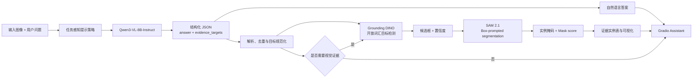
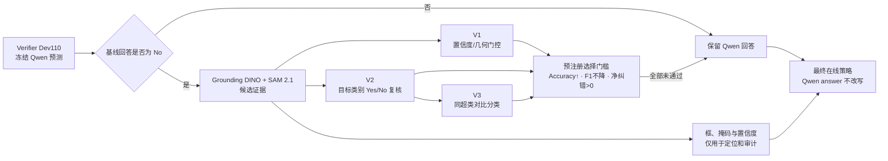
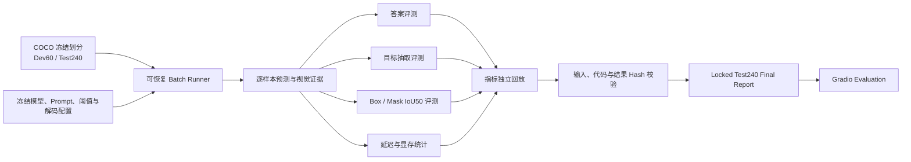

# 系统架构

## 在线推理链路

这条链路属于“回答后证据定位”：Qwen3-VL 同时生成答案和需要验证的对象，
Grounding DINO 与 SAM 2.1 将这些对象映射回图像。当前版本不会根据定位结果
重新改写答案；这是经过 Dev110 受控实验后冻结的部署策略，而不是尚未实现的
临时状态。

## Verifier 实验与最终部署边界

V1 在最佳阈值下产生 1 个有效纠错和 4 个错误纠正；V2 低阈值产生 1 个有效
纠错和 2 个错误纠正，高阈值则退化为高成本无变化；V3 能识别 `truck/car`
混淆，却丢失唯一的 `book` 有效纠错并继续误接收 `chair`。三类方案均未满足
预注册门槛，因此没有进入 held-out verifier 评测。最终系统保留基线回答，
同时保留视觉证据链作为可解释输出。

## 离线评测与结果冻结

## 模块职责

| 模块 | 输入 | 输出 | 设计目的 |
|---|---|---|---|
| Task-aware prompt | 问题、任务类型 | 系统提示词 | 限定回答格式和证据目标 |
| Qwen3-VL | 图像、问题、提示词 | Answer、targets | 完成语义理解和目标选择 |
| Structured parser | VLM 原始文本 | 规范化 JSON | 容错解析、去重、限制目标数 |
| Grounding DINO | 图像、目标短语 | Boxes、scores | 开放词汇短语定位 |
| SAM 2.1 | 图像、Boxes | Masks、mask scores | 提供像素级视觉证据 |
| Evaluator | 预测、COCO 标注 | 多阶段指标 | 区分回答、目标、框和掩码误差 |
| Gradio | 在线结果、冻结报告 | 交互页面 | 演示推理和审计实验结果 |

## 关键工程决策

1. **模块化而非端到端训练**：三个预训练模型可以独立替换和消融，适合离线
   服务器及单卡原型验证。
2. **结构化目标接口**：将 VLM 的自由文本与检测器的短语输入解耦，便于记录
   `target FP/FN`，定位错误来自语义阶段还是视觉定位阶段。
3. **串行懒加载**：Gradio 首次请求时加载模型，并通过单并发队列共享一张
   24 GB RTX 3090，避免并发推理造成显存峰值失控。
4. **严格测试冻结**：只在 Dev 上选择提示策略；Test 运行后禁止调参，并通过
   Hash 和指标回放验证最终结果没有被修改。
5. **以门槛决定部署而非展示偏好**：答案纠错模块必须同时提升准确率、保持 F1
   且取得正净纠错；三版 verifier 未达标后直接关闭改写，避免因个别成功案例
   上线整体负增益策略。

## 当前边界与下一步

- 当前目标词表和 Test240 标注主要来自 COCO，开放世界长尾概念覆盖有限。
- Grounding DINO 对小目标和密集同类实例仍是主要误差来源。
- 下一步应接入 POPE 与 RefCOCOg/GroundingME，增加公开协议和近期方法对比。
- 已验证的置信度门控、二分类复核和对比类别复核均未改善 Dev110；后续若继续
  研究闭环纠错，应在新的开发协议上引入校准置信度、可学习 verifier 或拒答
  机制，而不是继续针对当前 6 个案例调阈值。
